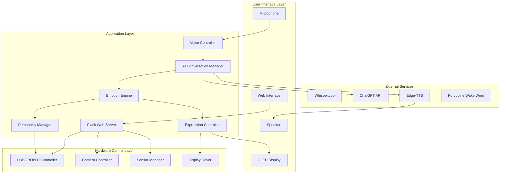

# Design Document

## Overview

This design transforms the existing Raspberry Pi 4B robot control system into an intelligent AI voice desktop pet by integrating advanced conversational AI, emotional expression capabilities, and personality-driven behaviors. The system builds upon the current web-based control interface, voice recognition, and robot movement capabilities while adding ChatGPT integration, text-to-speech synthesis, OLED display animations, and an emotional state management system.

The architecture maintains the existing Flask web server foundation while introducing new modules for AI conversation processing, emotional analysis, visual expression rendering, and personality-based behavior control. The design ensures backward compatibility with existing functionality while seamlessly integrating new AI desktop pet features.

## Architecture

### System Architecture Diagram



### Core Components Integration

The design integrates with existing components:
- **Existing Flask Web Server**: Extended with new AI conversation endpoints
- **Current Voice Controller**: Enhanced with wake word detection and AI integration
- **LOBOROBOT Hardware Controller**: Extended with personality-driven movement patterns
- **Web Interface**: Updated with AI conversation controls and emotional status display

## Components and Interfaces

### 1. AI Conversation Manager (`ai_conversation.py`)

**Purpose**: Orchestrates the complete AI conversation pipeline from wake word detection to response synthesis.

**Key Methods**:
```python
class AIConversationManager:
    def __init__(self, robot_controller, expression_controller)
    def start_conversation_mode()
    def stop_conversation_mode()
    def process_wake_word_detection()
    def handle_speech_input(audio_data)
    def send_to_chatgpt(text)
    def process_ai_response(response_text)
    def synthesize_and_play_speech(text)
```

**Integration Points**:
- Receives audio from enhanced VoiceController
- Sends text to ChatGPT API
- Triggers EmotionEngine for response analysis
- Coordinates with ExpressionController for visual feedback
- Manages conversation state and context

### 2. Emotion Engine (`emotion_engine.py`)

**Purpose**: Analyzes AI responses and conversation context to determine emotional states and trigger appropriate expressions and behaviors.

**Key Methods**:
```python
class EmotionEngine:
    def __init__(self)
    def analyze_response_emotion(text)
    def determine_movement_emotion(context)
    def get_current_emotional_state()
    def update_personality_context(conversation_history)
```

**Emotional States**:
- `happy`: Celebratory movements, bright expressions
- `excited`: Fast movements, animated expressions  
- `sad`: Slow movements, downward camera tilt
- `confused`: Head tilting, questioning expressions
- `thinking`: Gentle swaying, contemplative animations
- `neutral`: Default state with breathing animations

### 3. Expression Controller (`expression_controller.py`)

**Purpose**: Manages OLED display animations and facial expressions synchronized with conversation states.

**Key Methods**:
```python
class ExpressionController:
    def __init__(self, display_driver)
    def show_emotion(emotion_type)
    def animate_speaking(duration)
    def show_listening_animation()
    def show_thinking_animation()
    def show_idle_animation()
    def synchronize_mouth_with_tts(audio_stream)
```

**Animation Types**:
- Eye expressions (happy, sad, surprised, sleepy)
- Mouth animations (talking, smiling, frowning)
- Thinking indicators (dots, gears, question marks)
- Idle behaviors (blinking, breathing effects)

### 4. Personality Manager (`personality_manager.py`)

**Purpose**: Translates emotional states into robot movement patterns and behavioral responses.

**Key Methods**:
```python
class PersonalityManager:
    def __init__(self, robot_controller)
    def execute_emotional_movement(emotion, intensity)
    def handle_conversation_command(command, emotion)
    def get_personality_response_style()
    def adjust_movement_speed_for_emotion(base_speed, emotion)
```

**Movement Patterns**:
- Happy: Quick spins, bouncy movements
- Excited: Rapid direction changes, energetic gestures
- Sad: Slow movements, drooping camera angle
- Confused: Head tilts, hesitant movements
- Thinking: Gentle swaying, contemplative poses

### 5. Enhanced Voice Controller (`enhanced_voice_control.py`)

**Purpose**: Extends existing voice control with wake word detection and AI conversation integration.

**Key Enhancements**:
```python
class EnhancedVoiceController(VoiceController):
    def __init__(self, ai_conversation_manager)
    def initialize_wake_word_detection()
    def start_conversation_listening()
    def process_conversation_audio()
    def handle_wake_word_detected()
```

**Wake Word Integration**:
- Porcupine integration for "快快" detection
- Seamless transition from wake word to conversation mode
- Audio quality optimization for better recognition

### 6. Display Driver (`display_driver.py`)

**Purpose**: Low-level OLED display control for rendering expressions and animations.

**Key Methods**:
```python
class DisplayDriver:
    def __init__(self, display_type="SSD1306")
    def initialize_display()
    def draw_expression(expression_data)
    def animate_sequence(animation_frames)
    def clear_display()
    def set_brightness(level)
```

## Data Models

### Conversation Context
```python
@dataclass
class ConversationContext:
    session_id: str
    user_input: str
    ai_response: str
    emotion_detected: str
    timestamp: datetime
    conversation_history: List[Dict]
    personality_traits: Dict[str, float]
```

### Emotional State
```python
@dataclass
class EmotionalState:
    primary_emotion: str
    intensity: float  # 0.0 to 1.0
    secondary_emotions: Dict[str, float]
    duration: float
    triggers: List[str]
    movement_pattern: str
```

### Expression Animation
```python
@dataclass
class ExpressionAnimation:
    animation_type: str
    frames: List[bytes]
    duration_per_frame: float
    loop_count: int
    sync_with_audio: bool
```

### Personality Profile
```python
@dataclass
class PersonalityProfile:
    name: str = "快快"
    traits: Dict[str, float] = field(default_factory=lambda: {
        "friendliness": 0.8,
        "energy_level": 0.7,
        "curiosity": 0.6,
        "playfulness": 0.9
    })
    preferred_responses: List[str] = field(default_factory=list)
    movement_style: str = "bouncy"
    voice_characteristics: Dict[str, str] = field(default_factory=dict)
```

## Error Handling

### Network Connectivity Issues
- **Offline Mode**: Fall back to pre-programmed responses and local voice commands
- **API Failures**: Graceful degradation with friendly error messages
- **Retry Logic**: Exponential backoff for API calls with circuit breaker pattern

### Hardware Failures
- **Microphone Issues**: Visual indicators and web interface notifications
- **Display Failures**: Continue operation with audio-only feedback
- **Movement System Errors**: Safety-first approach with immediate stop commands

### Resource Management
- **Memory Constraints**: Conversation history pruning and efficient caching
- **CPU Overload**: Priority-based task scheduling with safety functions first
- **Storage Limits**: Automatic cleanup of temporary audio files

### Error Recovery Patterns
```python
class ErrorHandler:
    def handle_api_failure(self, error_type, retry_count)
    def fallback_to_offline_mode(self)
    def notify_user_of_error(self, error_message)
    def attempt_system_recovery(self)
```

## Testing Strategy

### Unit Testing
- **AI Conversation Manager**: Mock ChatGPT API responses, test conversation flow
- **Emotion Engine**: Test emotion detection accuracy with sample responses
- **Expression Controller**: Validate animation rendering and timing
- **Personality Manager**: Test movement pattern generation

### Integration Testing
- **Voice-to-AI Pipeline**: End-to-end conversation flow testing
- **Hardware Integration**: Test all sensor and actuator combinations
- **Web Interface**: Test new AI controls and status displays
- **Error Scenarios**: Test graceful degradation and recovery

### Performance Testing
- **Response Time**: Measure wake word to response completion time
- **Resource Usage**: Monitor CPU, memory, and network usage
- **Concurrent Operations**: Test multiple simultaneous functions
- **Long-term Stability**: Extended operation testing

### User Experience Testing
- **Conversation Quality**: Test natural dialogue flow and context retention
- **Emotional Expression**: Validate emotion-to-movement mapping accuracy
- **Visual Feedback**: Test OLED animation clarity and timing
- **Voice Recognition**: Test accuracy across different speaking styles

### Hardware-in-the-Loop Testing
```python
class HILTestSuite:
    def test_complete_conversation_cycle(self)
    def test_emotional_response_accuracy(self)
    def test_safety_override_systems(self)
    def test_multi_modal_interaction(self)
```

### Test Data Management
- **Conversation Samples**: Curated set of test conversations with expected emotions
- **Audio Test Files**: Various voice samples for recognition testing
- **Animation Sequences**: Reference animations for visual testing
- **Performance Benchmarks**: Target metrics for response times and resource usage

The testing strategy ensures robust operation across all interaction modes while maintaining the safety and reliability of the existing robot control system.