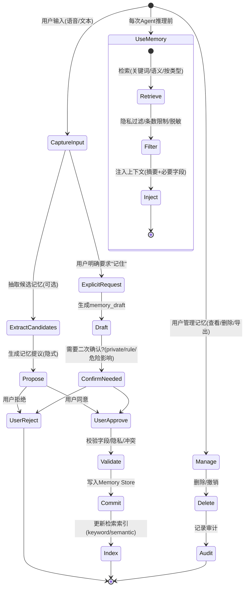

---

# 附录 1：Capability Spec 标准（JSON Schema）+ 错误码 + 幂等

## 1. 目标

* 让任何硬件/服务能力都能以统一方式被注册、发现、调用、审计
* 让 Orchestrator/Policy/Executor 能在不理解模块内部实现的情况下：

  * 校验参数
  * 执行安全门禁
  * 处理失败与重试
  * 避免重复执行（幂等）

---

## 2. 能力清单与模块清单

### 2.1 Module Manifest（模块声明）

**用途**：描述模块本身（来源、版本、权限、健康检查等）。

**字段（规范）**

* `module_id` (string, required)：全局唯一，如 `hw.led_strip`
* `module_version` (string, required)：语义化版本建议 `MAJOR.MINOR.PATCH`
* `vendor` (string, optional)
* `description` (string, required)
* `capabilities` (array<string>, required)：该模块暴露的 capability_id 列表
* `permissions_required` (array<string>, optional)：如 `gpio`, `i2c`, `network`, `filesystem.read`
* `healthcheck` (object, optional)：健康检查信息（endpoint、interval 等）
* `signature` (object, optional)：供应链签名信息（可选但建议）
* `risk_profile` (object, optional)：模块整体风险画像（是否包含危险能力、是否要求白名单）

---

### 2.2 Capability Spec（能力声明，核心）

**用途**：描述某个 Tool/Skill 的“调用契约”。

#### 2.2.1 顶层字段

* `capability_id` (string, required)：全局唯一，如 `tool.robot.speak`
* `name` (string, required)
* `type` (string, required)：`tool` | `skill`
* `version` (string, required)
* `description` (string, required)
* `risk_level` (string, required)：`READ_ONLY` | `NORMAL` | `DANGEROUS`
* `inputs_schema` (object, required)：JSON Schema（Draft 2020-12 或 07，版本可在系统配置中固定）
* `outputs_schema` (object, required)：JSON Schema
* `constraints` (object, required)：执行约束（见 2.2.2）
* `required_state_predicates` (array<object>, optional)：状态门禁（见 2.2.3）
* `permissions` (object, required)：权限与确认策略（见 2.2.4）
* `idempotency` (object, required)：幂等策略（见 4）
* `observability` (object, required)：审计要求（见 2.2.5)

#### 2.2.2 constraints（执行约束）

* `timeout_ms` (integer, required)：单次调用超时
* `rate_limit` (object, optional)：

  * `qps` (number)
  * `burst` (integer)
* `max_duration_ms` (integer, optional)：动作类工具的最大持续时间（如移动/播放）
* `cooldown_ms` (integer, optional)：调用后冷却（常用于危险动作）
* `max_payload_bytes` (integer, optional)：输入/输出体积约束
* `concurrency` (object, optional)：

  * `max_in_flight` (integer)
  * `mutex_group` (string) ：同组互斥（例如 `motion`）
* `retry_policy` (object, optional)：

  * `retriable_errors` (array<string>)：允许重试的错误码列表
  * `max_retries` (integer)
  * `backoff_ms` (integer)

#### 2.2.3 required_state_predicates（状态门禁）

用于表达“只有在某状态下才能执行”，由 Safety Policy Engine 强制执行。
每条 predicate：

* `key` (string) 如 `obstacle`
* `op` (string) 如 `==` `!=` `>` `>=` `in`
* `value` (any)
* `on_fail` (string) ：`DENY` | `CONFIRM`（失败是拒绝还是触发确认/降级）

示例：`obstacle == false`，失败则 DENY

#### 2.2.4 permissions（权限与确认）

* `roles_allowed` (array<string>, required)：如 `user`, `admin`
* `confirm_required` (boolean, required)：危险能力通常为 true
* `confirm_phrase_hint` (string, optional)：确认提示文案建议（Robot-first 语音更友好）
* `modes_allowed` (array<string>, optional)：如 `normal`, `safety`, `kid`, `debug`
* `deny_when_muted` (boolean, optional)：对 speak 类工具

#### 2.2.5 observability（审计与脱敏）

* `audit_level`：`MINIMAL` | `STANDARD` | `VERBOSE`
* `log_inputs` (boolean)
* `log_outputs` (boolean)
* `redaction` (array<object>)：脱敏规则

  * `json_path` (string) 如 `$.text`
  * `method` (string) `MASK` | `HASH` | `DROP`

---

## 3. JSON Schema 最小示例（能力声明）

下面是一个 **tool.robot.speak** 的能力声明示例（供你照抄扩展）：

```json
{
  "capability_id": "tool.robot.speak",
  "name": "Speak",
  "type": "tool",
  "version": "1.0.0",
  "description": "Convert text to speech and play it on the robot speaker.",
  "risk_level": "NORMAL",
  "inputs_schema": {
    "$schema": "https://json-schema.org/draft/2020-12/schema",
    "type": "object",
    "properties": {
      "text": { "type": "string", "minLength": 1, "maxLength": 400 },
      "volume": { "type": "number", "minimum": 0.0, "maximum": 1.0, "default": 0.7 },
      "voice": { "type": "string", "default": "default" }
    },
    "required": ["text"],
    "additionalProperties": false
  },
  "outputs_schema": {
    "$schema": "https://json-schema.org/draft/2020-12/schema",
    "type": "object",
    "properties": {
      "ok": { "type": "boolean" },
      "utterance_id": { "type": "string" }
    },
    "required": ["ok"],
    "additionalProperties": false
  },
  "constraints": {
    "timeout_ms": 8000,
    "rate_limit": { "qps": 2, "burst": 3 },
    "concurrency": { "max_in_flight": 1, "mutex_group": "audio" }
  },
  "required_state_predicates": [],
  "permissions": {
    "roles_allowed": ["user", "admin"],
    "confirm_required": false,
    "modes_allowed": ["normal", "safety", "kid", "debug"]
  },
  "idempotency": {
    "mode": "IDEMPOTENT",
    "key_fields": ["text", "volume", "voice"],
    "ttl_ms": 10000
  },
  "observability": {
    "audit_level": "STANDARD",
    "log_inputs": true,
    "log_outputs": true,
    "redaction": [
      { "json_path": "$.text", "method": "MASK" }
    ]
  }
}
```

---

## 4. 幂等策略（Idempotency）

**目的**：网络重试、模型重发、用户重复说同一句，都不能导致危险动作重复执行。

### 4.1 幂等策略字段

`idempotency` 对象：

* `mode`：`NONE` | `IDEMPOTENT` | `DEDUP_ONLY`

  * NONE：不保证（不建议用于危险能力）
  * IDEMPOTENT：同幂等键重复调用返回同结果/同 invocation_id
  * DEDUP_ONLY：重复调用直接拒绝或返回 “DUPLICATE” 错误（适合动作类）
* `key_fields`：参与计算幂等键的输入字段列表
* `ttl_ms`：幂等去重窗口
* `side_effect_class`：`NO_SIDE_EFFECT` | `SOFT_SIDE_EFFECT` | `HARD_SIDE_EFFECT`（可选）
* `supports_cancellation`：是否支持 cancel（可选）

### 4.2 幂等键来源（优先级）

1. 上层显式提供 `idempotency_key`（推荐：由 Orchestrator 对每次用户请求产生 trace_id 派生）
2. 若无显式 key，则按 `key_fields` 对 input 规范化后 hash

### 4.3 不同能力的推荐模式

* 传感器读取（read-only）：`IDEMPOTENT` 或 `NONE` 都可
* `speak`：`IDEMPOTENT`（避免重复播报）
* 灯光/开关类：`IDEMPOTENT`（set to ON 具幂等性）
* **运动/高风险动作**：推荐 `DEDUP_ONLY` + 短 TTL（防止多跑一段）

  * 重复请求：返回 `E_DUPLICATE`（并记录审计）

---

## 5. 错误码规范（Error Code Spec）

### 5.1 统一错误对象

所有能力调用失败必须返回统一错误对象：

* `code`：稳定的字符串错误码（用于机器处理）
* `message`：简短人类可读说明（可用于日志）
* `user_message`：可选，适合直接播报的友好文案（Robot-first 建议）
* `details`：可选，结构化诊断信息（脱敏）
* `retryable`：boolean
* `retry_after_ms`：可选（限流/冷却时）

### 5.2 错误码分类（前缀建议）

* `E_INPUT_*`：输入参数/Schema 校验失败
* `E_STATE_*`：状态门禁不满足（障碍、急停、电量低…）
* `E_POLICY_*`：权限/确认/模式不允许
* `E_RATE_*`：限流/冷却
* `E_TIMEOUT`：超时
* `E_CANCELLED`：被取消/急停
* `E_NOT_FOUND`：能力不存在/模块不存在
* `E_DEPENDENCY_*`：外部依赖失败（云 ASR/TTS、网络）
* `E_INTERNAL`：模块内部错误
* `E_DUPLICATE`：幂等去重命中

### 5.3 最小错误码列表（建议必须支持）

* `E_INPUT_SCHEMA`
* `E_POLICY_CONFIRM_REQUIRED`
* `E_POLICY_ROLE_DENIED`
* `E_STATE_OBSTACLE`
* `E_STATE_ESTOP`
* `E_STATE_BATTERY_LOW`
* `E_RATE_LIMITED`
* `E_COOLDOWN_ACTIVE`
* `E_TIMEOUT`
* `E_CANCELLED`
* `E_NOT_FOUND`
* `E_DEPENDENCY_NETWORK`
* `E_DEPENDENCY_PROVIDER`
* `E_INTERNAL`
* `E_DUPLICATE`

---

# 附录 2：Memory Spec（字段/类型/注入/隐私）+ 记忆治理流程图

## 1. 目标

* 让机器人具备跨会话的“稳定记忆”，并且**不乱记、不泄露、可撤销**
* 让记忆不仅服务对话，还服务“机器人行为约束”（Robot-first 很关键）

---

## 2. 记忆条目模型（Memory Entry Spec）

### 2.1 顶层字段（必需）

* `id`：全局唯一
* `type`：枚举（见 2.2）
* `content`：结构化对象（必须可字段化）
* `summary`：一句话摘要（用于“我记住了什么”列表）
* `source`：`user_explicit` | `user_implicit` | `system_detected` | `imported`
* `confidence`：0~1 或 `low/med/high`
* `privacy_level`：`private` | `normal` | `shareable`
* `created_at`, `updated_at`
* `ttl`：可选（到期自动归档/删除）
* `tags`：可选（数组）
* `links`：可选（与 capability_id / device_id / location_id 的关联）

### 2.2 type 枚举（建议基线）

* `preference`：用户偏好（音量、称呼、风格、确认策略）
* `fact`：稳定事实（用户称呼、家庭成员称呼等）
* `rule`：行为规则（夜间静音、危险动作必须确认）
* `device`：设备画像（硬件能力、阈值、校准、故障史）
* `location`：地点/区域命名（客厅、书房、禁区）
* `task`：任务/计划（未完成事项、周期性任务）
* `incident`：故障与事件（某次过热、某次撞到障碍）
* `skill_state`：技能运行状态（巡逻上次进度、参数）
* `other`

### 2.3 content 结构（示例）

**preference**

```json
{
  "key": "speech.volume.default",
  "value": 0.5,
  "scope": "global",
  "constraints": { "min": 0.0, "max": 1.0 }
}
```

**rule**

```json
{
  "rule_id": "night_mute",
  "when": { "time_range": "22:00-07:00" },
  "then": { "action": "set_mode", "mode": "mute" },
  "enforcement": "hard"
}
```

**device**

```json
{
  "device_id": "motion_base",
  "limits": { "max_linear": 0.15, "max_duration_ms": 1500 },
  "calibration": { "wheel_bias": 0.02 },
  "notes": "地毯上容易打滑"
}
```

---

## 3. 记忆写入策略（Memory Write Policy）

### 3.1 显式写入（必须支持）

触发条件：

* 用户明确：“记住… / 以后都这样 / 从现在开始…”

流程要求：

* 系统生成 `memory_draft`（结构化）
* 若 `privacy_level=private` 或 `type=rule` 且影响危险能力 → 必须二次确认
* 确认后写入并回读摘要

### 3.2 隐式写入（必须支持“提议”，可配置默认关闭）

触发条件：

* 系统从对话中抽取到可能有价值的信息（偏好/规则/设备约束/地点）

要求：

* 必须先提议：“我可以记住 X 吗？”
* 用户拒绝 → 不写入
* 用户同意 → 写入，并标记 `source=user_implicit`

---

## 4. 注入策略（Context Injection Policy）

### 4.1 注入目标

* 给 Agent 提供足够信息做正确决策
* 避免 token 爆炸、隐私泄露、记忆污染

### 4.2 注入选择规则（建议基线）

每次请求生成注入包：

1. **硬规则优先**：`rule` / `device` 中与本次能力相关的约束（尤其危险能力）
2. **偏好次之**：如音量、称呼、确认偏好
3. **任务上下文**：进行中 task/skill_state（如果相关）
4. **事实/地点**：只注入强相关条目

### 4.3 数量与大小限制

* 注入条数上限：默认 5（可配置）
* 每条条目注入为 `summary + 必要字段`，而非全量 content
* 对 `private` 条目：默认不自动注入；仅在明确相关且策略允许时注入（或需要用户授权）

### 4.4 敏感字段处理（必须）

* 任何密钥、精确位置信息、家庭成员隐私：默认不注入
* 对外部模型：按最小化原则，只发必要摘要

---

## 5. 隐私规则（Privacy Policy）

### 5.1 privacy_level 含义

* `private`：默认不注入、不在 UI 列表明文展示（只显示摘要或“已隐藏”），删除需确认
* `normal`：可注入摘要，可展示
* `shareable`：可用于更广泛上下文（例如多设备同步，若未来支持）

### 5.2 记忆生命周期治理

* 必须支持：查看、导出、删除、按类型清理、按时间清理
* 支持 TTL：到期自动归档或删除（策略可配置）
* 必须记录审计：谁触发写入/删除、来源、时间、理由

---

## 6. 记忆治理流程图（Mermaid）



---

## 7. 记忆与 Robot-first 的联动点（建议写进系统规则）

* `rule` / `device` 类型记忆应影响 Policy Engine（例如夜间静音、危险动作必须确认、地毯限速）
* `skill_state` 用于让机器人“接着上次继续”（例如“继续巡逻”）

